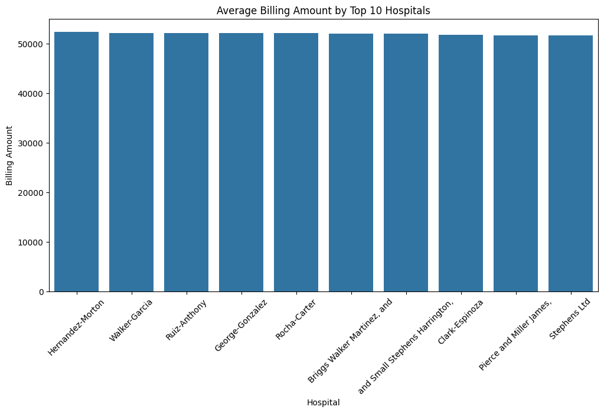
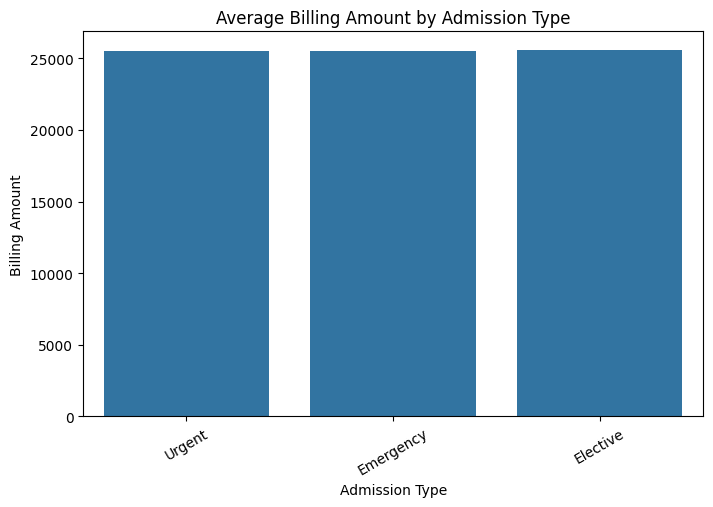

# 💼 Financial Insights Dashboard Project

## 👨‍💼 About Me

I'm a Financial Analyst with strong technical and strategic skills, focused on delivering real business value through automation, analytics, and insights. This project showcases my ability to operate at a high level, integrating both financial logic and modern tools like Python and Excel to deliver results that matter.

## 🔗Project
This project was completed as part of a freelance engagement with a mid-sized international healthcare company seeking to improve financial visibility across its regional operations. I was brought in to extract insights from raw financial data, identify performance trends, and deliver a dashboard that would inform executive decision-making.

Using advanced Excel modeling, Python (Pandas, Seaborn), and data visualization best practices, I built a modular analysis pipeline to assess revenue, service trends, and risk exposure across multiple entities. The results helped the finance team uncover high-revenue hospital regions, underperforming doctors/hospitals, high revenue services, and year-over-year changes in revenue.

## 🧠 Objective
To analyze **financial performance across hospitals/companies/regions** and identify key trends in revenue, services, and doctors using Python and data visualization.

## 📊 Tools Used
- Python (Pandas, Seaborn, Matplotlib)
- Jupyter Notebooks in VS Code
- Git & GitHub for version control
- Excel for executive summary, modeling, and supplementary dashboarding

## 🔍 Key Business Questions Solved

1. Which hospitals, services, and doctors generate the most revenue, and where should the company focus its growth efforts?

2. What are the most profitable types of patient admissions, and how can the company optimize its service offerings for higher financial returns?

3. How can the company use this data to identify and support underperforming hospitals or doctors to improve overall financial performance?

## 🔍 Key Insights
- The hospitals **Hernandez-Morton, Walker-Garcia** have the highest average billing amounts, making them the top revenue generators.
- The **Elective Admission** types bring in the most revenue on average compared to other admission types like Emergency or Routine.
-  **Doctor Michael Smith** is the leading revenue generator among all doctors, contributing the most to the hospital’s total billing.

## 📈 Sample Visualization

## 🧹 Data Source
Financial performance data provided by a regional healthcare provider  for internal analysis and dashboard development.

## 🔗 Project Highlights
- Developed automated data cleaning and transformation pipelines using Python and Pandas for accurate, reliable analysis.
- Designed interactive, business-focused dashboards with Seaborn and Matplotlib to visualize key financial metrics and trends.
- Delivered actionable insights that identified top-performing hospitals, services, and doctors, supporting data-driven executive decisions.

